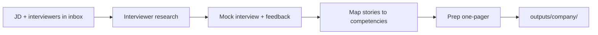

# Interview Prep OS

A **template operating system** for preparing for senior/executive interviews with AI — candid mock interviews, interviewer research, story-to-competency mapping, and a per-loop prep one-pager.

Built for ambitious candidates (PM, GM, and other leadership roles) who want a repeatable prep process instead of cramming the night before. It calibrates to your **target level** — Senior PM (IC), Staff/Principal PM (IC), or Director/VP/GM — so the bar matches the role you're actually interviewing for.

---

## What this is

| Component | Purpose |
|-----------|---------|
| **Sub-agents** | Interviewer personas — **hiring manager**, **executive recruiter**, **VP of Engineering**, **VP of Design**, and a **case interviewer** (live product cases) — so you can rehearse a full loop |
| **Prep skill** | A `/prep-interview` orchestrator that runs the workflow: research, mock interview, story mapping, and prep doc |
| **Config** | Your candidate profile, target roles, and a reusable story bank the AI draws from |
| **Reference framework** | Competency rubric, level calibration (Senior IC → exec), STAR method, mock-interview format, product-case frameworks, and metrics-fluency cheat sheet |
| **Company research** | A deep-dive template (business model, competitor comparison, key metrics) that drives toward a strategic POV on the gap the role would own |
| **Outputs** | One folder per interview loop: interviewer research + a prep one-pager |
| **Example** | A fully worked sample for a fictional candidate so you can see the end state |

This repo ships with **fictional demo data** (a candidate named *Jordan Rivera*). Replace it with your own to make it yours — nothing here is anyone's real information.

---

## Quick start

```bash
git clone <your-repo-url> interview-prep-os
cd interview-prep-os
```

Then:

1. Fill in `config/candidate-profile.md`, `config/target-roles.md`, and `config/story-bank.md` (the demo content shows you the shape — overwrite it).
2. For an upcoming interview, create a folder under `inbox/interviews/<company-slug>/` and drop in the job description and the list of interviewers.
3. Ask your AI agent: **"Run /prep-interview for `<company>`"** — or just *"Help me prep for my `<company>` interview."*
4. The agent will research the interviewers, run a mock interview with feedback, and generate a prep one-pager in `outputs/<company-slug>/`.

---

## Workspace layout

```
interview-prep-os/
├── CLAUDE.md                       # Agent instructions (Cursor / Claude Code)
├── skill/
│   ├── prep-interview/             # Orchestrator (copy into .claude/skills/ to activate)
│   ├── hiring-manager/             # Mock-interview & feedback persona
│   ├── executive-recruiter/        # Positioning, comp & process persona
│   ├── vp-engineering/             # Eng-partnership interviewer persona
│   ├── vp-design/                  # Design-partnership interviewer persona
│   └── case-interviewer/           # Live product-case interviewer persona
├── config/                         # Your profile, target roles, story bank
├── Knowledge/Reference/            # Frameworks (edit rarely)
├── templates/                      # One-pager, interviewer & company research, cases, 90-day plan, questions bank
├── inbox/interviews/               # Job descriptions + interviewer lists (your input)
├── outputs/                        # Generated prep docs per company
└── examples/                       # Fictional worked example
```

---

## Core workflow



**The loop, in order:**

1. Load your profile, target role, and story bank
2. Research the company and each interviewer
3. Build a company deep dive and land a **strategic POV** on the gap the role owns
4. Run a realistic mock interview (incl. product cases), with calibrated feedback after each answer
5. Map your strongest stories to the competencies this role screens for
6. Produce a one-pager: who you're meeting, what they'll probe, your best stories, and your POV

---

## Customization

| File | Customize? |
|------|------------|
| `config/candidate-profile.md` | **Yes** — your background, scope, strengths, and watch-outs |
| `config/target-roles.md` | **Yes** — the roles/companies you're targeting and why, plus your **target level** (Senior PM IC / Staff-Principal IC / exec), which the personas calibrate the bar to |
| `config/story-bank.md` | **Yes** — your 6–8 anchor stories in STAR form |
| `Knowledge/Reference/*.md` | Rarely — the frameworks; fork if you want a different rubric |
| `skill/*/SKILL.md` | Optionally — tune the personas' style and toughness |

---

## Requirements

- An AI coding agent: **Claude Code** or **Cursor** (recommended), or Claude.ai with the skill pasted in
- That's it — this is a docs-and-prompts system, no code to run

---

## Publishing as a GitHub template

1. Create a new repo on GitHub (e.g. `interview-prep-os`)
2. Push this directory, then in **Settings → General → Template repository**, enable **Template repository** so others can click "Use this template."

---

## License

[CC BY 4.0](LICENSE) — free to use, adapt, and share (even commercially) with attribution. The demo persona is fictional; any resemblance to real people is coincidental.
